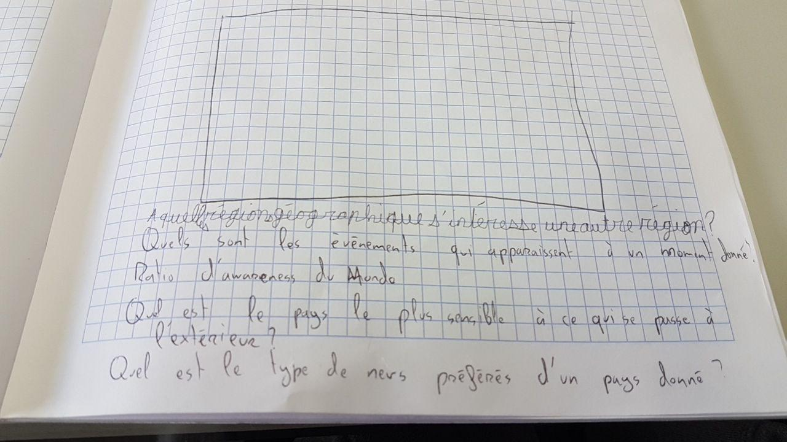
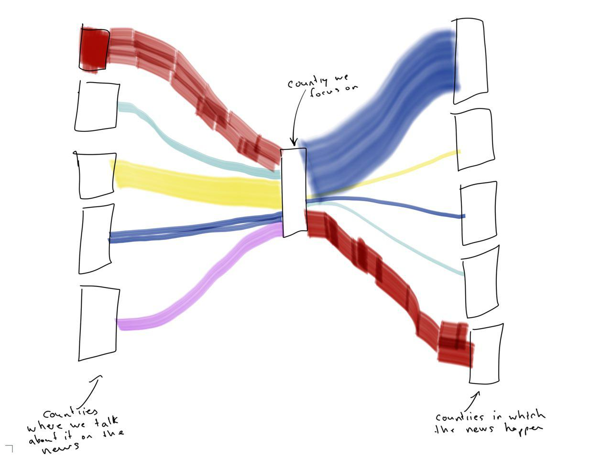
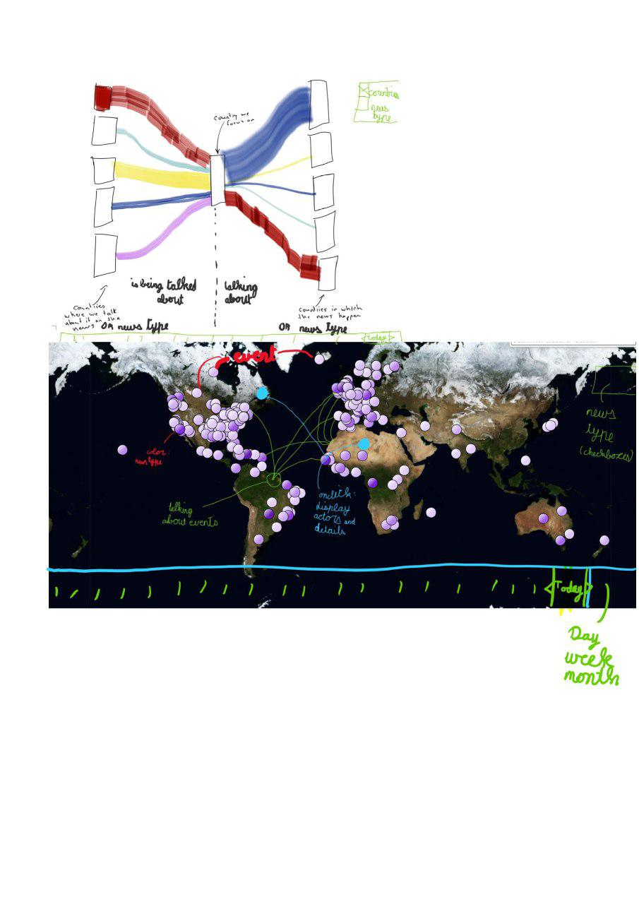
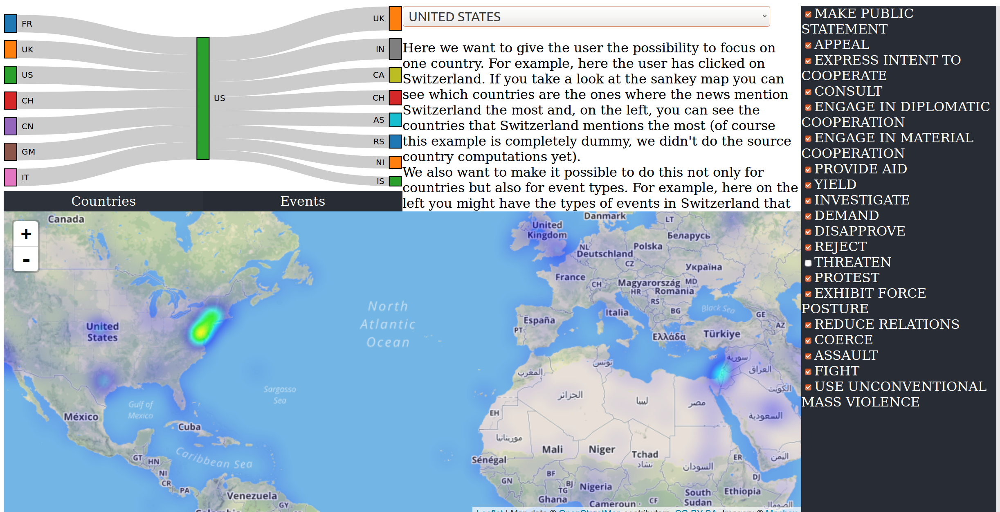
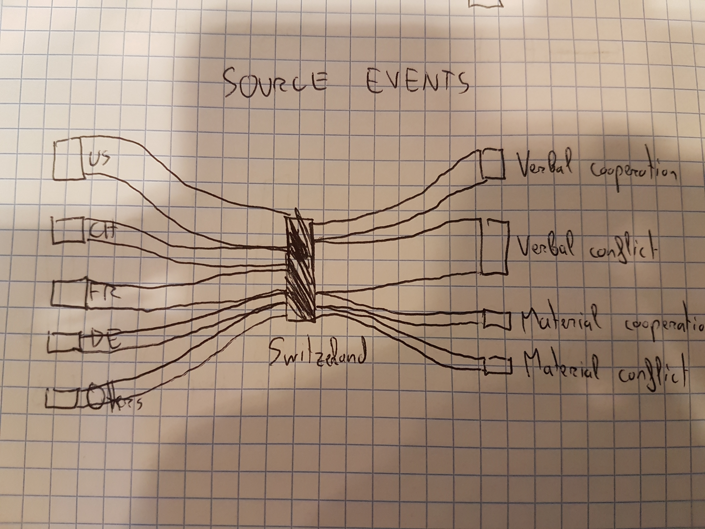
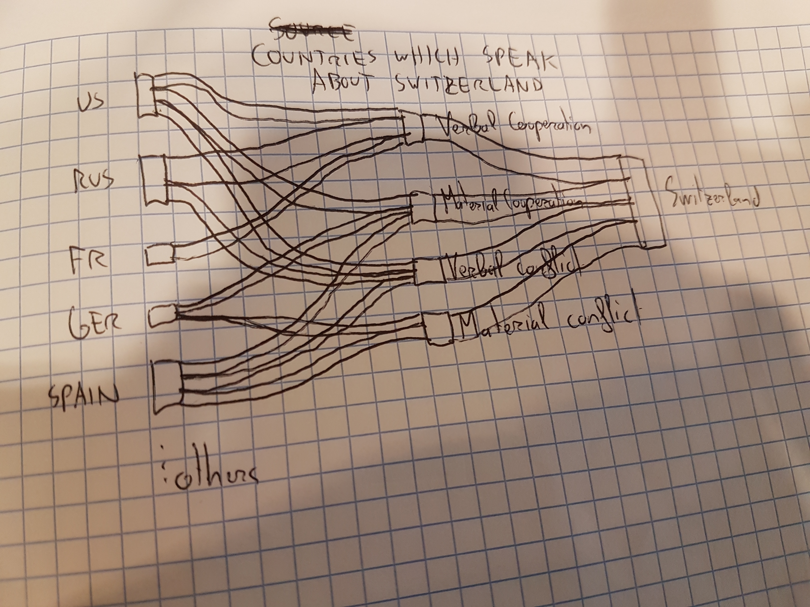
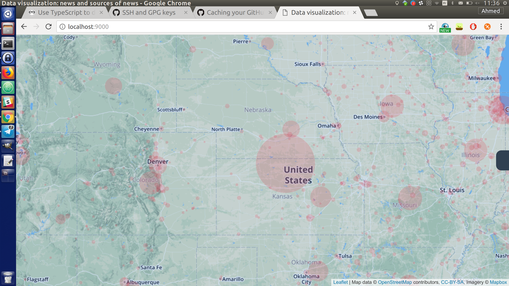

# Data visualization process book
In this file we will keep a log of what we do week by week.

## Week 8
Brainstorming about what kind of project we might do. We thought about combining our project with our ADA project but, unfortunately, we are not in the same group for that course so there was no point doing that. We brainstormed and came up with a few idea until we seemed pretty sure about one specific idea: trying to visualize the news in the World and where the news "come from". For example, we would like to ask some questions like "If we choose one country, which are the countries it talks the most about ?". Or maybe we would also like to know which are the countries that talk the most about this country in their news.

### How to do that ?
Good question ? We came up with a few ideas among which:

* We might want to visualize the flow "where the news are written => where they happen" and vice-versa. For example it would be a moving heat map-of-the-World layer. At one point we have the heatmap showing where the events are happening and then we can click on a switch so that the points corresponding to these events move smoothly to the places where the news about them are produced. For example, if something happens in Hong Kong and the New York Times writes about it then the point on the heatmap will move smoothly from Hong Kong to New York (and vice-versa if we click on the switch again)

* We might also want to visualize the "egoism" level of countries, maybe in a choropleth map. For example, the US would probably have a very high level of egoism since most of their news would be about themselves. The idea would really be to visualize how much a given country is aware of the rest of the world.

## Week 9

We start working. We divide the work among ourselves and we explore the dataset with much more details (we use mostly python for that because it is much more convenient than javascript) and we also start exploring d3 with more details also.
We also continue with the brainstorming from last week because, even if we have a general idea of what we want to do, we would like to be as clear as possible about our goals. Here is a sketch of our discussions:

We also came up with a new cool idea: instead of countries we might want to choose "events flows" for a given country (we have the CAMEO event code in our GDELT dataset which is very convenient for that). For example, instead of wanting to know which countries Switzerland speaks the most about, we would like to know which types of event it talks the most about instead ! Does it talk about negotiations, or wars, or protests ?

## Week 10
We had the idea to use the sankey diagram which seems to be very convenient for showing our data:

To incorporate the idea of visualizing events instead of countries, we might add a simple switch "Events/Countries" to that.
Of course, we would also draw a heatmap of events:

We would also like to add a time widget so that the viewer can choose which time period he wants to focus on. But that may be a little too optimistic because we already have a lot of work to do. If we have time then we will add it!

We asked the assistant and showed him the sketches and he seemed to like it a lot. However, there is one problem remaining: in the GDELT dataset we have the news website URL but we do not have the country those news are coming from. So we need to find a way to deal with that. What came to our mind is to simply query those URLs and to take the IP address. Then we would get the country from this IP address. One problem with this method is that some news might host their website on a server in another country so it might not be 100% correct. However, we found a website listing the news websites in the world and the countries those news are located in. With the IP technique + a little manual work everything should bw fine now, We can get the news source country !

## Week 11
Managed to program a first basic interface:

The data on the Sankey diagram is not correct since we did not finish processing the data but it should be pretty good until the end of the week (if we don't get stuck in some annoying bugs).
However we can already select the type of events we want to visualize on the heatmap, and it seems to work well.

Asked the prof about it, he told that it seems good but it is pretty ugly (We didn't intend to make it pretty in the beginning). He told us that there are too many checkboxes, which is right, so we will need to find a way to cateogrize further the types of events.

We met on Thursday and discussed with the design should be. One idea we have to respect is that we should not throw as much info as possible on the user as soon as he sees the webpage. So this is why we will show only the map with the event distribution in the beginning, without anything else. However, the user will see that he has the possibility to click on a country to see the country details in a drawer (drawers are a very good way to show information which we can hide at user will).
The details will include the sankey news flow diagram (two diagrams: events-based and country-based as discussed above). We will also have another drawer on the right to allow the user to filter the types of events she wants. The professor told me that there were too many types of events and this is why we have decided to do an accordion checkbox structure to allow "hierarchical checkboxes". In this hierarchy, we will have only four "super event types" (corresponding to the QuadClass attribute in our GDELT dataset) which the user can expand to show the event types. Those 20 event types can be further divided but we don't plan to implement this for now (unless we have time).

Regarding the localisation of each source of news, we have decided that we won't use the location of the server at all and only use the real position of the source when it is available. Although, we haven't decided yet what to do with the event
whose news is unlocated.

## Week 12
We are still working on the visualization. Ali is working on the accordion side menu for filtering event types and he's trying to make it as beautiful as possible, Maxime is working on processing the data in python so that we have data which is as clean as possible and Ahmed is working on the visualization, drawing the circles on the map with Leaflet and d3 and showing the sankey diagram information.

### The hover idea:
We thought of a new way to add interactivity to our sankey diagram. Maybe we could show additional information when the viewer hovers a link: when a link from a country to the selected country is hovered, we can color the link in a chosen color (let's say blue for the example) and then color all the corresponding events in the same blue. We can also add blue lines on the map which go from the source countries to the target events (for that we need the central geocoordinates for each country. [This](https://developers.google.com/public-data/docs/canonical/countries_csv) might be a good catch.)

### The flow problem
We realized that one thing was not so good with our sankey diagram. Actually, we don't event need a sankey diagram for this because we can represent such information with simple bar charts ! We simply need two bar charts: one for the source countries and one for the target countries (same for the event types). And also, the notion of flow does not really make sense in this context: the number of news which "enters" Switzerland is not the same as the number which "goes out". So we came up with this solution where, instead of putting the target countries on the right, we put the types of the source events.

This way, the flow makes sense: the number of events (the width of the flow) is the same on both sides. However, this one has two disadvantages:
* same as before: we can represent the information with bar charts. So we are just adding chart junk here.
* it is not clear at first sight.

We thought about dropping the idea of the sankey diagram but then, we came up with something much better:

This diagram allows us to keep the sankey (somehow we absolutely wanted to keep the sankey diagram to show this "event flow" information) and the disadvantages we mentioned before disappear: it is more difficult to represent this with a bar chart (we could still represent it with a 2d histograms but it is visually more difficult to read than the sankey diagram) and it is much clearer.

### circles: the nonprecision problem
Now we have our visualization with our red circles on the map:

So we can see the red circles which show the distribution of events on the map. We noticed one problem: look at the big red circle at the center. It is not really directed at a special big city (like the other big circles we can typically see on important cities like New York, Los Angeles or Washington) but it is one of the biggest circles in the US. Actually, the problem is the data: we have a lot of news where the GDELT team didn't have enough resources to compute the exact location of the event so they simply put it at the centroid of the United States. This problem is also visible for other countries (or states also). So what do we do about this ?

* We can simply drop those events but this is rather complicated: we have to find the centroid for each country (or states) and to make sure that the geolocation of the event doesn't coincide with it. However, it would probably not be the exact same location (except if we find out how GDELT generated it) so we would probably have to include the notion of "proximity". If the event is near the centroid of the country then we drop eat. And here again new problems show up: what if an important city is located at or near the centroid of the country/state. What does it mean "to be near the centroid" ? How do we handle that for big and small countries (even tiny ones like Liechtenstein).
* Or we can simply keep them. It is true that this information somehow disturbs the viewer but it is also a visualization of the GDELT dataset so we can keep it. Anyway, if the GDELT team finds more resources and is capable of geolocating these events with more precision in the future, our visualization will be cleaner !

So obviously we chose to keep all the events.

### circles: the details idea

If we look on our map we have the circles which show the distribution of data. But how about we try to allow the user to look at the details for each circle if he clicks on them ?
For example, we can have the countries which talk the most about that particular location. But we could also have the events so let's do a stacked bar chart for this:

We might also do something more: we might show all the source -> target lines in blue and unzoom our map to see which countries are talking about this particular circle.

### circles: the hovering problem
Now that we have the possibility to click on a circle we have a new problem: there are two clickable layers and it seems like Leaflet doesn't like that. Our idea was that the user can click on circles but, if they click on a point which belongs to a country but is not a circle, then it is as if they clicked on the country and the sankey diagram for the selected country shows up on the left in the drawer. However, this is a bad idea because, sometimes, the dense distribution of the events might make it annoying to find a place where to click for the country details.

So we found a very simple solution: if the user clicks somewhere on the map, then it is as if they clicked on the country. However, if they hold the Control key and click then the event is interpreted as a click on a circle. We just have to make this clear enough to the user.

### circles: size with respect to zoom level
We noticed a small issue on our visualization: we keep the radius of the circles constant with respect to the zoom level. This is not a problem if the zoom level is small and we see a lot of circles. However, if we zoom on a place and start searching for the circles where 1, 2 or few events occured then the size of the circles is very small (the same size it was on the unzoomed map) so it's rather annoying to "find them".

Our solution for that will simply be to vary the radius of the circles depending on the zoom level

### The loading problem
One problem is that, even after preprocessing our data and removing a lot of stuff, we had a lot of news remaining (approximately 160000 for one single day). This is fine for one day (approximately 2-3 seconds to load) but it starts becoming annoying if we want to show data for more than that. For example, we thought about showing the data for one month or one week or even one year. But this is simply impossible. We already tried to aggregate the data but even after that there are too many events. We also thought about randomly removing data but this doesn't make a lot of sense. So, for now, we will show the data for one day. If we have time we will add a timeline for the user to be able to select the day they want.

### The missing source locations
Around 25% of the event have an unknown source location. However, when we looked at which website those news came from, we saw almost all of them came from websites that are not affiliated with any country. For this reason, we decided to create a new category named "International" that contains every news mentionned above.

## Week 13
### The hovering deadlock problem
We had an annoying problem with the sankey links hover functionality. When we hover upon one sankey link we want to show all the circles corresponding to that link in blue. We also show a blue line between the country geolocation (we have a file for that) and the geolocation where the event occured. The line and the circle size increase with the number of events. This was working fine on the Github pages server or on our powerful home computers. But unfortunately it was creating deadlocks on our laptop (at least on Ubuntu Linux): there are many events to draw so let's say the user hovers on one link and unhovers very rapidly after that. This will launch two asynchronous functions: one for drawing and one for removing the canvas. But the website would often get stucked at this point (probably because the two asynchronous functions were accessing the canvas at the same time). So we found a solution: we used the d3-queue module and but those function in a queue so that they are executed one after the other even if they are asynchronous. This solved our problem even on laptops !

## Final remarques
As the data we display needs to be online and the whole data weighted over 200 GB, we had to select a small interval of data to keep and display. We chose to keep the events that happened between November 20th and December 19th 2017. Moreover, we had to limit the maximum aggregate size to 3 days. That means that the user will be able to see 3 days of events at most at the same time. We chose to set this limit because it took too long to process a bigger amount of data for the user experience to be enjoyable.

### Possible improvements
When hovering a country that has lots of sources on the Sankey diagram, the visualisation becomes overloaded with links, and unfortunately, we have not had the time to find a good solution to this problem without removing information.